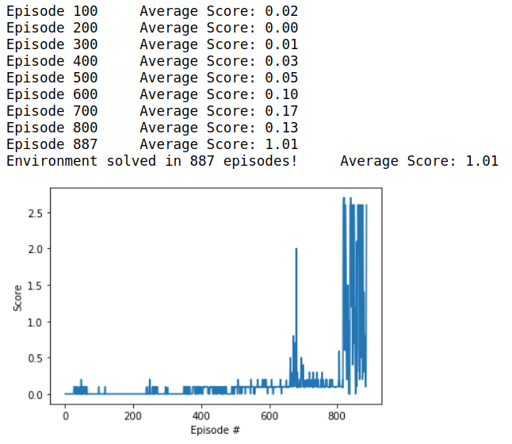

[//]: # (Image References)

# Project 3: Collaboration and Competition - Report

### Settings

**Implementation:** The project is implemented in `python 3.6` and within a `jupyter notebook`. 
The following packages where imported:
```python
from unityagents import UnityEnvironment
import numpy as np
import copy

import torch
import torch.nn as nn
import torch.nn.functional as F
import torch.optim as optim

import time
import random

from collections import namedtuple, deque

from ddpg_multi_agents import Agents

import matplotlib.pyplot as plt
%matplotlib inline
```
The agents have been implemented within `ddpg_multi_agents.py`.
The actor and critic model has been implemented within `ddpg_models.py`.
**`Pytorch 1.4.0`** has been used with **`CUDAToolkit 10.1`**.
The operating system is `ubuntu 18.04`.
Unity 2019.3 has been installed on the computer.
The Unity environment is `Tennis_Linux/Tennis.x86_64` and has been provided by Udacity. 

### Model

The project has been solved with the help of two deep neural networks: 
The **Actor** NN consisting of **4 linear layers**:
- one input layer of size 8 (=size of the state space).
- two hidden layers of size 128 each.
- one output layer of size 2 (= size of the action space).
The activateion function is **Relu**.
A **batch normalization** is used for the input and the two hidden layers.

### Agent

The project has been solved with two **DDPG** agents. The Implementation of the DDGP agent is done according to [`DDPG`](https://arxiv.org/pdf/1509.02971.pdf)

##### Hyperparameter
- The replay buffer size is 100000
- The batch size is 128
- Gamma = 0.99
- Tau = 0.001 (for soft update of target parameters)
- Learning rate for the Actor = 0.001
- Learning rate for the Critic = 0.001
- The weight decay is 0

##### Algorithm Description
1. Each of the 20 agents receives the 33 environmet values.
2. Each agent passes these values through the `local-actor network` to receive 4 action values as a result. To encourage exploration, some noise, according to an Ornstein-Uhlenbeck process, is added to the predicted actions.
3. The action values are executed. Each agent receives from the environment the next state, reward, and the value of done according to the action values that have been presented to the environment.
4. The experience tuple of each agent consisting of the `state, action, reward, next state, done` is added to a shared replay buffer.
5. If there are enough elements within the replay buffer, randomly sample a batch of experiences from the replay buffer.
6. Use the sample to update the weights of the `local-critic network`:
 	- obtain the next-action by a forward pass through the `target-actor network`.
 	- obtain the Q-value for the next-state and next-action by a forward pass through the `target-critic network`.
 	- obtain the target Q-value y<sub>i</sub> = `reward + Gamma * Q-value(next-state, next-action)`.
 	- obtain the current Q-Value by a forward pass of the current states and current actions through the `local-critic network`.
 	- compute the loss between the current Q-Values and the target Q-Values.
 	- update the weights of the `local-critec network`.
 7. Use the sample to update the weights of the `local-actor network`:
 	- obtain predictid actions by a forward pass of the current state through the `local-actor network`.
 	- use the current state and the predicted actions for a forward pass through the `local-critic network` to get the predicted Q-values.
 	- use the negative mean of the predicted Q-values to update the weights of the `local-actor network`.
8. Soft-update the `target-actor network` and the `target-critic network`. 

### Training

The maximum number of training episodes is 500.
The maximum number of timesteps per episode is 1000.

### Result

The result of the training is shown in the plot below. The value for solving the task was lifted from +0.5 to +1.0. 



### Future Improvements
To improve performance one might consider to optimize the hyperparameters, like the network architecture, learning rates etc. and / or use alternative learning algorithms like multi-agent DDPG. 